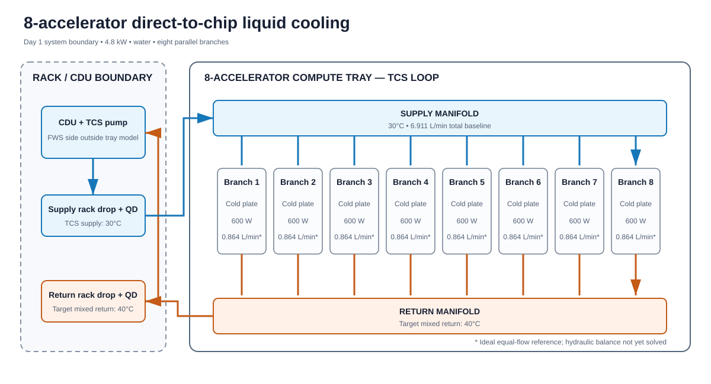
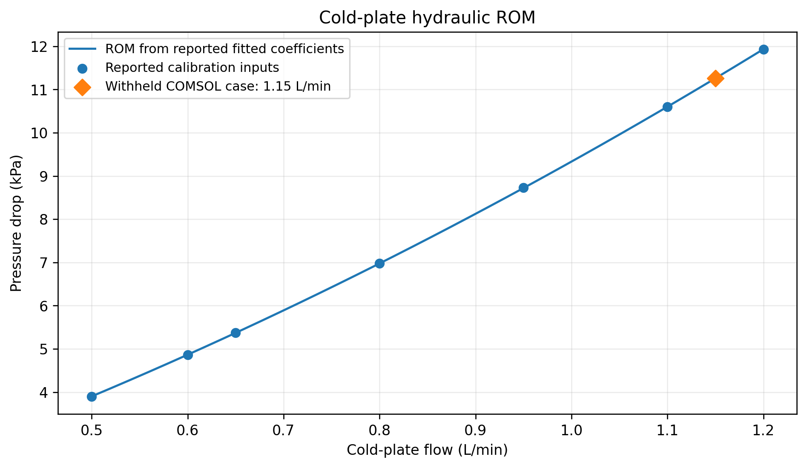
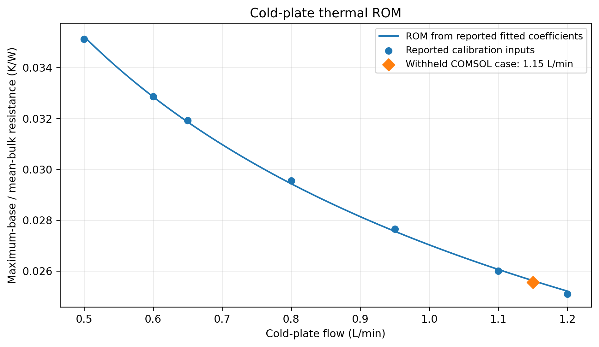
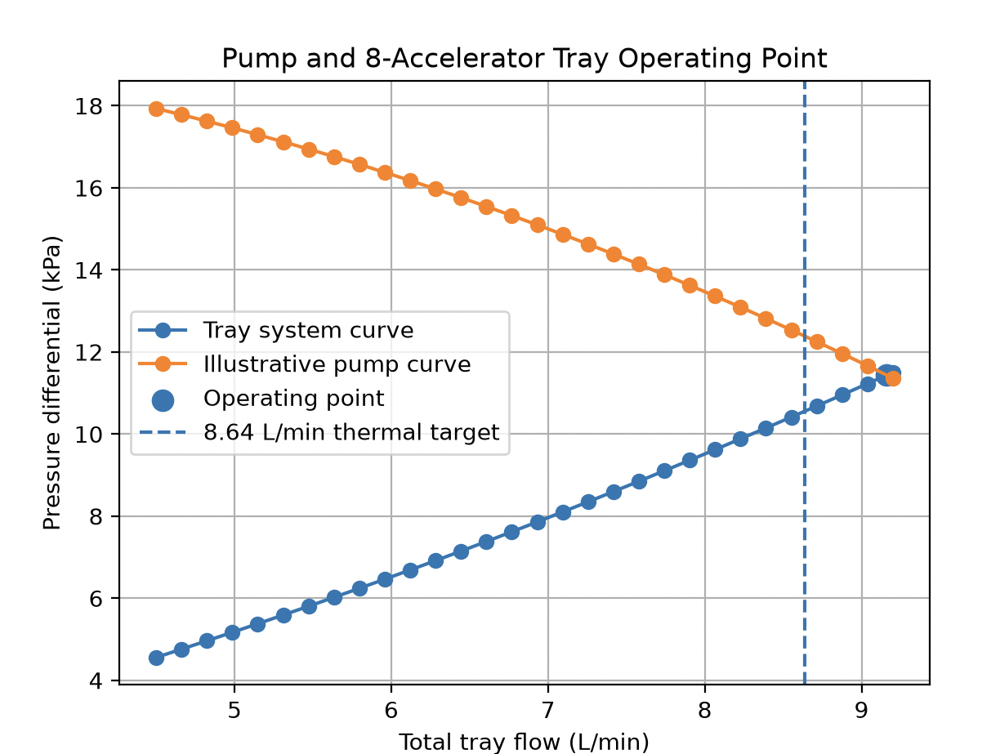
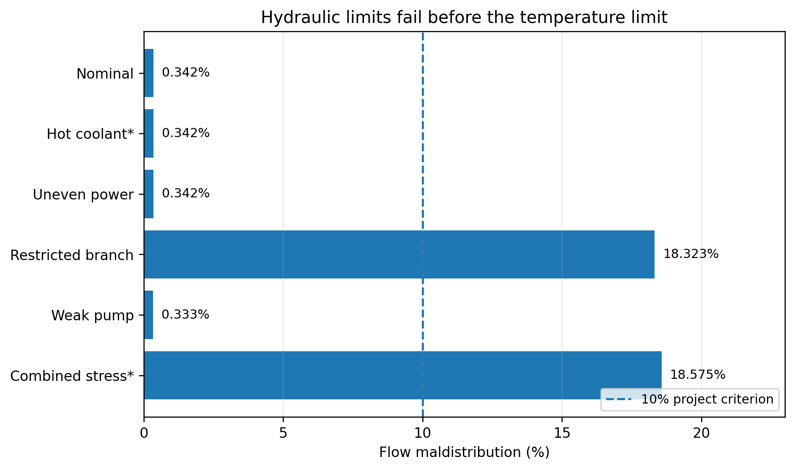

# Thermal–Hydraulic Co-Design of an AI Accelerator Cooling Tray

**8-accelerator · 6 kW direct-to-chip liquid cooling · Python / COMSOL / reduced-order modeling**

A system-level thermal–hydraulic design study connecting **cold-plate CFD**, component reduced-order models, nonlinear manifold hydraulics, and an illustrative pump curve to predict branch flow, pressure drop, and device thermal margin.

**Key engineering finding:** a modeled 30% increase in one branch hydraulic resistance increased flow maldistribution from approximately **0.34% to 18.32%**, violating the project's 10% flow-uniformity criterion while the estimated peak device temperature remained **75.05°C**, below the **85°C** project limit.

## Read in two minutes

| Nominal modeled result | Value |
|---|---:|
| Thermal design load | **8 × 750 W = 6.0 kW** |
| Illustrative pump–tray operating flow | **9.1604 L/min** |
| Tray differential pressure, S1 to R1 | **11.4374 kPa** |
| Minimum / maximum branch flow | **1.1438 / 1.1477 L/min** |
| Flow maldistribution | **0.342%** |
| Estimated peak device temperature | **72.72°C** |
| Margin to 85°C project criterion | **12.28°C** |

[Portfolio overview](docs/portfolio/README.md) · [Validation notes](docs/portfolio/docs/VALIDATION_AND_LIMITATIONS.md) · [Repository validation](docs/portfolio/docs/REPOSITORY_INTEGRATION.md)

The operating point is a **model prediction for an illustrative pump coupled to the tray**, not a measured pump/CDU qualification result.

## System architecture



## Design problem

Size the headers and evaluate pump capability for eight parallel cold plates while meeting temperature, flow, and flow-uniformity targets. The modeled boundary is **S1 to R1**, the first supply and return nodes of the tray; it includes cold plates, branch tubing, QDs, fittings, and supply/return manifolds.

| Project criterion | Target |
|---|---:|
| Estimated device temperature | ≤ 85°C |
| Total flow | ≥ 8.64 L/min, approximately a 10°C coolant rise at 6 kW |
| Flow maldistribution | ≤ 10% |
| Provisional minimum branch flow | ≥ 0.65 L/min at 750 W |

These are project criteria, not vendor limits. Water enters at 30°C. Estimated device temperature adds a temperature rise of **device power × (0.020 + 0.005 K/W)** for the assumed package and TIM resistances to the maximum cold-plate base temperature; it is not a resolved junction temperature.

## From cold-plate CFD to a scalable system model

**COMSOL CFD → component ROMs → withheld CFD comparison → N-branch manifold → pump–tray and fault predictions.** The reduced-order models (ROMs) carry component pressure drop and thermal resistance into the network calculation, allowing header and fault studies without a new full-tray CFD solve for each case.

The selected numerical geometry, **Candidate C**, has 30 channels, each 0.40 × 1.00 mm and 50 mm long. Seven flow points span **0.50–1.20 L/min at 750 W and 30°C inlet**. Selected 450–750 W checks at 0.65 and 1.10 L/min showed approximately 0.02% resistance variation, supporting a flow-only thermal-resistance fit under those modeled conditions.

For normalized branch flow, the reported fits are:

```math
q = \frac{\dot V}{1\,\mathrm{L/min}}
```

```math
\Delta p_{\mathrm{CP}} = (6.27583432\,\mathrm{kPa})q + (3.05693213\,\mathrm{kPa})q^2
```

```math
R_{\theta,\max} = (0.02702393958\,\mathrm{K/W})q^{-0.38230560298}
```

Thermal resistance uses the maximum base temperature relative to mean bulk coolant temperature:

```math
R_{\theta,\max} = \frac{T_{\mathrm{base},\max} - (T_{\mathrm{in}} + T_{\mathrm{out}})/2}{P_{\mathrm{heat}}}
```

| Hydraulic ROM | Thermal ROM |
|---|---|
|  |  |

Reported calibration mean / maximum absolute percentage errors are **0.0676% / 0.2093%** for pressure drop and **0.2753% / 0.4738%** for thermal resistance. The plots use reported coefficients and rounded calibration inputs; detailed [fit records and sources](docs/portfolio/README.md#3-cfd-derived-component-rom) are retained in the portfolio documentation.

### Withheld CFD comparison

A **1.15 L/min, 750 W, 30°C** COMSOL point was excluded from fitting. Both pressure drop and thermal resistance agree within **0.3% at this withheld point**:

| Quantity | Reported COMSOL | ROM | Signed error* |
|---|---:|---:|---:|
| Pressure drop | 11.258 kPa | 11.260002 kPa | +0.0178% |
| Maximum-base / mean-bulk resistance | 0.0255542 K/W | 0.0256179 K/W | +0.2493% |
| Coolant outlet temperature | 39.408°C | 39.3895°C | −0.0185°C |
| Maximum base temperature | 53.870°C | 53.9082°C | +0.0382°C |

*Errors are relative to COMSOL for pressure and resistance, and ROM − COMSOL for temperatures. Reported CFD energy-balance error was **0.0188%**. This comparison establishes ROM-to-CFD agreement at one withheld condition within the sampled flow range; it does not establish hardware accuracy or validation across all flow, power, and inlet-temperature combinations.

## Header sizing and pump coupling

The nonlinear **N-branch same-side manifold solver** enforces total-flow conservation and pressure compatibility between adjacent branches. Each branch combines the cold-plate ROM with tubing, QD, and fitting losses; header segments carry the sum of downstream branch flows. Darcy–Weisbach losses use the Churchill friction correlation. Branch tubing is 9.5 mm ID with 0.30 m each for supply and return; QD/fitting coefficients are illustrative.

Flow maldistribution measures the branch-flow range relative to the mean:

```math
M_{\mathrm{flow}} = 100\,\frac{\dot V_{\max} - \dot V_{\min}}{\overline{\dot V}}\quad [\%]
```

### Decision: retain a provisional 19.05 mm header

The [diameter / local-loss study](docs/portfolio/figures/03_header_local_loss_sensitivity.png) compared **12.7, 15.0, 19.05, and 25.4 mm** IDs. Smaller headers were more sensitive to local losses; **19.05 mm** was retained as the modeling baseline. It is not a demonstrated global optimum or a released mechanical design. Some exploratory small-header cases exceed the ROM flow range.

At 19.05 mm and fixed **8.64 L/min**, the reported sensitivity cases kept all eight branches in the 0.50–1.20 L/min range:

| Header local-loss coefficient | Flow maldistribution | Peak estimated device temperature | Tray temperature spread |
|---:|---:|---:|---:|
| 0 | 0.3466% | 73.443°C | 0.043°C |
| 1 | 4.2610% | 73.592°C | 0.527°C |
| 2 | 8.0391% | 73.738°C | 0.982°C |

These historical reported values differ from current solver exports; the [documented comparison](docs/portfolio/docs/REPOSITORY_INTEGRATION.md#unresolved-fixed-flow-sensitivity-discrepancy) preserves both records pending reconciliation of the originating run/configuration. The nominal operating-point results below use an **idealized zero header local-loss coefficient**; actual junction behavior remains a validation need.

### Pump–tray operating point

Intersecting the illustrative pump curve with the tray pressure requirement gives **9.1604 L/min at 11.4374 kPa**, a **6.02% flow margin** over the 8.64 L/min target.



Hydraulic power is **1.7462 W**; at an assumed **50% efficiency**, estimated electrical power is **3.4924 W**. This covers the S1-to-R1 tray load only. Common lines, CDU heat exchanger/filter losses, and facility plumbing are outside the pressure budget.

## Fault study: thermal margin does not guarantee flow compliance

| Scenario | Total flow (L/min) | Minimum branch (L/min) | Flow maldistribution | Estimated peak device temperature | Project requirement status |
|---|---:|---:|---:|---:|---|
| Nominal | 9.1604 | 1.1438 | 0.342% | 72.72°C | Pass |
| Hot coolant* | 9.1604 | 1.1438 | 0.342% | 77.72°C | Pass* |
| Uneven power | 9.1604 | 1.1438 | 0.342% | 72.72°C | Pass |
| Restricted branch | 9.0632 | 0.9534 | 18.323% | 75.05°C | Fail: maldistribution |
| Weak pump | 8.2056 | 1.0246 | 0.333% | 74.10°C | Fail: fixed flow target |
| Combined stress* | 8.1016 | 0.8499 | 18.575% | 81.67°C | Fail: flow + maldistribution* |

*The 35°C inlet cases are constant-property temperature sensitivities, not independently CFD-validated inlet conditions. Uneven-power and combined cases use seven 600 W devices plus one 750 W device (**4.95 kW**) while retaining the fixed **8.64 L/min** design target.



**Engineering implication:** a 1.30× multiplier on one branch's hydraulic characteristic produces **18.323% maldistribution** while estimated peak device temperature remains **75.05°C**. This represents increased branch resistance, not 30% blocked channel area or internal blockage heat-transfer effects. Reduced pump capability also violates the fixed flow target. Both need attention even with temperature margin; these results do not establish a fault-qualified tray.

## Review the evidence and run the checks

- [Two-page case study](docs/portfolio/portfolio/Project2_Case_Study.pdf) — concise engineering narrative.
- [Portfolio details](docs/portfolio/README.md), [validation and limitations](docs/portfolio/docs/VALIDATION_AND_LIMITATIONS.md), and [source index](docs/portfolio/data/source_manifest.csv) — assumptions, reported data, and evidence traceability.
- [Component ROM](component_rom/coldplate_rom.py), [manifold solver](network_solver/network_model/n_branch_manifold.py), and [fault analysis](network_solver/network_model/fault_offdesign_analysis.py) — implementation.
- [Repository verification](docs/portfolio/docs/REPOSITORY_INTEGRATION.md) — test scope, data consistency, and unresolved discrepancies.

From the repository root, in a Python environment with the model and test dependencies installed:

```bash
python -B -m pytest -p no:cacheprovider tests/
python -B docs/portfolio/scripts/check_package.py
```

The available suite covers branch hydraulics, the cold-plate ROM, and the earlier Day 1 energy balance. The package checker verifies documentation links, tables, and arithmetic. These checks do not rerun COMSOL or validate a complete tray against hardware.
