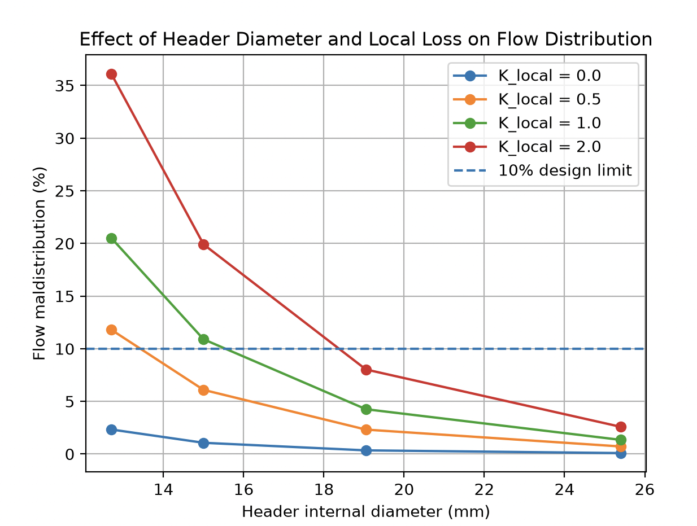
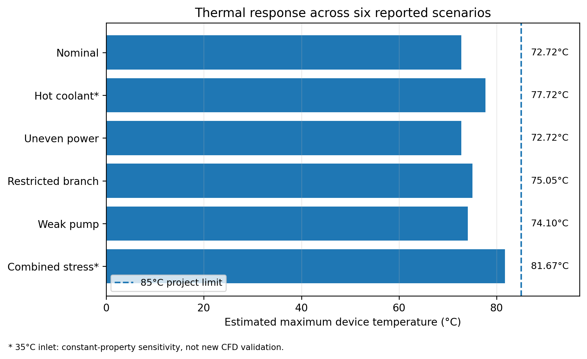

# Thermal-Hydraulic Co-Design of an AI Accelerator Cooling Tray

**Yuan Gao · Selected engineering portfolio project · Python / COMSOL / liquid cooling**

A model-based design study of an **8-accelerator, 6 kW direct-to-chip liquid-cooling tray**, connecting cold-plate CFD to component reduced-order models, nonlinear manifold hydraulics, a representative pump curve, and fault-response analysis.

**Central finding:** hydraulic operating requirements can be violated before the estimated device temperature reaches its limit. A 30% branch-resistance increase produced **18.32% flow maldistribution** while peak device temperature remained **75.05°C**, below the project's 85°C limit. [E01](evidence/fault_results_reported.png)

## Read in two minutes

| Nominal modeled result | Value |
|---|---:|
| Thermal design load | 8 × 750 W = **6.0 kW** |
| Pump/tray operating flow | **9.1604 L/min** |
| Tray differential pressure, S1 to R1 | **11.4374 kPa** |
| Minimum / maximum branch flow | **1.1438 / 1.1477 L/min** |
| Flow maldistribution | **0.342%** |
| Estimated peak device temperature | **72.72°C** |
| Margin to the 85°C project limit | **12.28°C** |

The operating point is a **prediction for an illustrative pump coupled to the modeled tray**, not a measured pump/CDU qualification result. Sources: [E01](evidence/fault_results_reported.png), [E02](evidence/nominal_operating_point_reported.png). The [two-page case study](portfolio/Project2_Case_Study.pdf) provides the short narrative; [validation notes](docs/VALIDATION_AND_LIMITATIONS.md) explain the evidence boundaries.

## 1. Engineering question and scope

How should a high-power accelerator tray combine cold-plate performance, header sizing, branch resistance, and pump capability to meet temperature, flow, and flow-uniformity targets?

The modeled boundary is the tray between its first supply and return nodes. The workflow includes cold plates, supply/return manifolds, branch tubes, and illustrative QD/fitting losses. It does not claim a facility-water, chiller, HVAC, or complete CDU design.

```text
COMSOL cold-plate CFD
        ↓
Hydraulic + thermal component ROMs
        ↓
Branch tubing / QDs / fittings
        ↓
N-branch same-side manifold network
        ↓
Pump–tray operating point
        ↓
Per-device temperatures and fault requirements
```

The final numerical geometry carries forward **Candidate C**: 30 channels, each 0.40 × 1.00 mm, with 50 mm channel length. The provisional common header ID is 19.05 mm; branch tubing ID is 9.5 mm with 0.30 m supply and 0.30 m return lengths. These are model inputs, not a mechanically released tray layout. [E10](evidence/CONVERSATION_MODEL_RECORD.md)

## 2. Requirements and assumptions

| Item | Adopted value | Interpretation |
|---|---:|---|
| Nominal coolant | Water, 30°C inlet | Component CFD reference condition |
| Device-temperature ceiling | 85°C | Project criterion; not a vendor limit |
| Total-flow target | 8.64 L/min | Fixed design target, approximately 10°C coolant rise at 6 kW |
| Flow-uniformity target | M_flow ≤ 10% | Project criterion, not an industry-wide standard |
| Provisional minimum branch flow | 0.65 L/min at 750 W | Margin-oriented design threshold |
| Package + TIM resistance | 0.020 + 0.005 K/W | Lumped assumptions for estimated device temperature |
| QD / fitting model | Two QDs, K = 1 each; fitting K_total = 1 | Illustrative coefficients referenced to branch-tube velocity |
| Pump characteristic | 20 kPa shutoff parameter; 14 L/min free-flow parameter | Illustrative curve |
| Pump efficiency | 50% | Assumed efficiency, not a measured map |

The hydraulic tube/header model uses fixed coolant properties. The thermal model adds a package/TIM temperature rise to the cold-plate maximum base temperature; **device temperature is not a directly simulated junction temperature**. [E10](evidence/CONVERSATION_MODEL_RECORD.md)

## 3. CFD-derived component ROM

Candidate C was screened using COMSOL conjugate heat-transfer results and then sampled over flow. Targeted power checks at 0.65 and 1.10 L/min showed approximately 0.02% resistance variation between 450 and 750 W in the configured model. This supported a flow-only resistance model, with heat load entering through the energy balance. This is not proof that temperature-dependent properties are negligible in all hardware. [E10](evidence/CONVERSATION_MODEL_RECORD.md)

Let $q^*=\dot V/(1\,\mathrm{L/min})$. The reported revised fits are:

$$\Delta p_{\rm CP}=(6.27583432\,\mathrm{kPa})q^*+(3.05693213\,\mathrm{kPa})(q^*)^2$$

$$R_{\theta,\max}=(0.02702393958\,\mathrm{K/W})(q^*)^{-0.38230560298}$$

Here the resistance reference is explicit:

$$R_{\theta,\max}=\frac{T_{\rm base,max}-(T_{\rm in}+T_{\rm out})/2}{P_{\rm heat}}.$$

The flow calibration spans **0.50–1.20 L/min at 750 W and 30°C inlet**. Sparse additional power checks span 450–750 W. This is not a full factorial validation of every input combination.

| Reported calibration metric | Hydraulic ROM | Thermal ROM |
|---|---:|---:|
| Mean absolute percentage error | 0.0676% | 0.2753% |
| Maximum absolute percentage error | 0.2093% | 0.4738% |


The curves above were replotted from the **reported coefficients and rounded calibration inputs**; they are not new CFD runs. Source: [coefficient record](data/reported_rom_coefficients.json), [transcribed calibration inputs](data/rom_calibration_transcribed.csv), [E10](evidence/CONVERSATION_MODEL_RECORD.md).

### Independent extension check

A **1.15 L/min, 750 W, 30°C** COMSOL point was withheld from fitting. Re-evaluating the reported ROM coefficients gives:

| Quantity | COMSOL, reported | ROM | Error convention |
|---|---:|---:|---|
| Pressure drop | 11.258 kPa | 11.260002 kPa | +0.0178% |
| Maximum-base / mean-bulk resistance | 0.0255542 K/W | 0.0256179 K/W | +0.2493% |
| Coolant outlet temperature | 39.408°C | 39.3895°C | −0.0185°C |
| Maximum base temperature | 53.870°C | 53.9082°C | +0.0382°C |

The reported CFD energy-balance error was **0.0188%**. These comparisons establish ROM agreement with the supplied CFD result, not hardware accuracy. [E03](evidence/comsol_validation_1p15_reported.png), [E04](evidence/rom_validation_1p15_reported.png), [comparison data](data/validation_1p15_comparison.csv).

## 4. Scalable manifold and branch hydraulics

The same-side network has N unknown branch flows. It imposes overall flow conservation and N−1 adjacent pressure-compatibility equations:

$$\sum_{i=1}^{N}\dot V_i=\dot V_T$$

$$\Delta p_{b,i}-\Delta p_{b,i+1}=\Delta p_{s,i}+\Delta p_{r,i}.$$

Each inter-branch supply/return segment carries the sum of downstream branch flows. Total branch pressure includes the cold plate, supply and return tubing, QDs, and fittings. Header/tube losses use Darcy–Weisbach plus local-loss terms, with a Churchill Darcy-friction correlation. The correlation provides numerical continuity; transition-region and tee-flow behavior remain model limitations. [E10](evidence/CONVERSATION_MODEL_RECORD.md)

Flow maldistribution is defined as:

$$M_{\rm flow}=100\frac{\dot V_{\max}-\dot V_{\min}}{\overline{\dot V}}.$$

### Header-sizing decision

The exploratory study compared 12.7, 15.0, 19.05 and 25.4 mm IDs with header local-loss sensitivity K_local = 0, 0.5, 1 and 2. Smaller headers were substantially more sensitive to local losses. **19.05 mm is the provisional baseline**, not a demonstrated global optimum or a released part selection. [E07](evidence/header_sensitivity_reported.png)



This original figure is exploratory: some small-header / high-K cases can require cold-plate flows outside the supported ROM domain. It is retained with that limitation, not presented as a fully qualified design map. The updated 19.05 mm fixed-flow cases below had 8/8 branches within the 0.50–1.20 L/min flow range. [E05](evidence/tray_fixed_flow_sensitivity_reported.png)

| Header K_local at fixed 8.64 L/min | M_flow | Peak estimated device T | Full-tray T spread |
|---:|---:|---:|---:|
| 0 | 0.3466% | 73.443°C | 0.043°C |
| 1 | 4.2610% | 73.592°C | 0.527°C |
| 2 | 8.0391% | 73.738°C | 0.982°C |

Increasing K from 0 to 2 raised the peak by about **0.30°C**, while the spread approached **0.98°C**. This is a conditional nominal-flow result, not a universal statement that maldistribution is harmless.

## 5. Pump–tray operating point

The model solves the intersection of the illustrative pressure-rise curve and the tray pressure requirement:

$$\Delta p_{\rm pump}(\dot V_T)=\Delta p_{\rm tray}(\dot V_T).$$


The reported nominal point is **9.1604 L/min at 11.4374 kPa**, or **6.02% flow margin** above the fixed 8.64 L/min target. Hydraulic power is **1.7462 W**; with an assumed 50% efficiency, estimated pump electrical power is **3.4924 W**. This power applies to the modeled tray load and the assumed curve, not a complete CDU or facility cooling system. [E02](evidence/nominal_operating_point_reported.png), [E08](evidence/pump_curve_reported.png)

## 6. Six-scenario robustness study

| Scenario | Total flow (L/min) | Minimum branch (L/min) | M_flow | Estimated Tmax | Reported requirement status |
|---|---:|---:|---:|---:|---|
| Nominal | 9.1604 | 1.1438 | 0.342% | 72.72°C | Pass |
| Hot coolant* | 9.1604 | 1.1438 | 0.342% | 77.72°C | Pass* |
| Uneven power | 9.1604 | 1.1438 | 0.342% | 72.72°C | Pass |
| Restricted branch | 9.0632 | 0.9534 | 18.323% | 75.05°C | Fail: maldistribution |
| Weak pump | 8.2056 | 1.0246 | 0.333% | 74.10°C | Fail: fixed flow target |
| Combined stress* | 8.1016 | 0.8499 | 18.575% | 81.67°C | Fail: flow + maldistribution* |

Source: [E01](evidence/fault_results_reported.png); [machine-readable reported results](data/fault_offdesign_reported.csv). *The 35°C cases are **constant-property inlet-temperature sensitivity calculations**, not independently CFD-validated temperature conditions. Status labels are retained from the reported requirement checker.

The uneven-power and combined cases use seven 600 W devices and one 750 W device (4.95 kW total). Their status checker retains the fixed 8.64 L/min design target; it does not recompute a load-following flow requirement. The restricted case multiplies one branch hydraulic characteristic by 1.30; it is not a model of 30% blocked channel area. [E10](evidence/CONVERSATION_MODEL_RECORD.md)




**Decision:** retain the 19.05 mm header as the provisional modeling baseline. Document branch restriction and reduced pump capability as hydraulic requirement failures even where the estimated temperature stays below 85°C. Do not describe the design as fault-qualified: the tested faults expose limitations rather than establishing universal fault tolerance.

## 7. Software / evidence organization

The working project architecture discussed in the study is:

```text
component_rom/coldplate_rom.py
network_solver/components/branch_hydraulics.py
network_solver/network_model/n_branch_manifold.py
network_solver/network_model/tray_thermal_coupling.py
network_solver/network_model/pump_operating_point.py
network_solver/network_model/fault_offdesign_analysis.py
```

Those live model files are **not included or independently rerun in this documentation package**. It contains the case study, reported data, figures, source records, resume copy, and release checklist. The prior user-reported test count was 21 cold-plate tests and 25 total tests at that stage; it is not asserted to be the final integrated test-suite count.

## Package navigation

- [Case study PDF](portfolio/Project2_Case_Study.pdf) and [editable Word version](portfolio/Project2_Case_Study.docx)
- [Selected projects and technical skills](portfolio/Selected_Projects_and_Skills.docx)
- [Resume bullets and interview summary](docs/RESUME_AND_INTERVIEW.md)
- [Figure order and captions](docs/FIGURE_GUIDE.md)
- [Validation, assumptions and reporting limits](docs/VALIDATION_AND_LIMITATIONS.md)
- [Release / repository integration checklist](docs/RELEASE_CHECKLIST.md)
- [Source index](data/source_manifest.csv)

Run the included documentation checks with `python scripts/check_package.py`. This checks the packaged tables and links; it does not execute the original engineering model. No CFD-runtime speedup, hardware test, vendor-qualified pump selection, full-tray CFD validation, or experimentally verified junction temperature is claimed.
